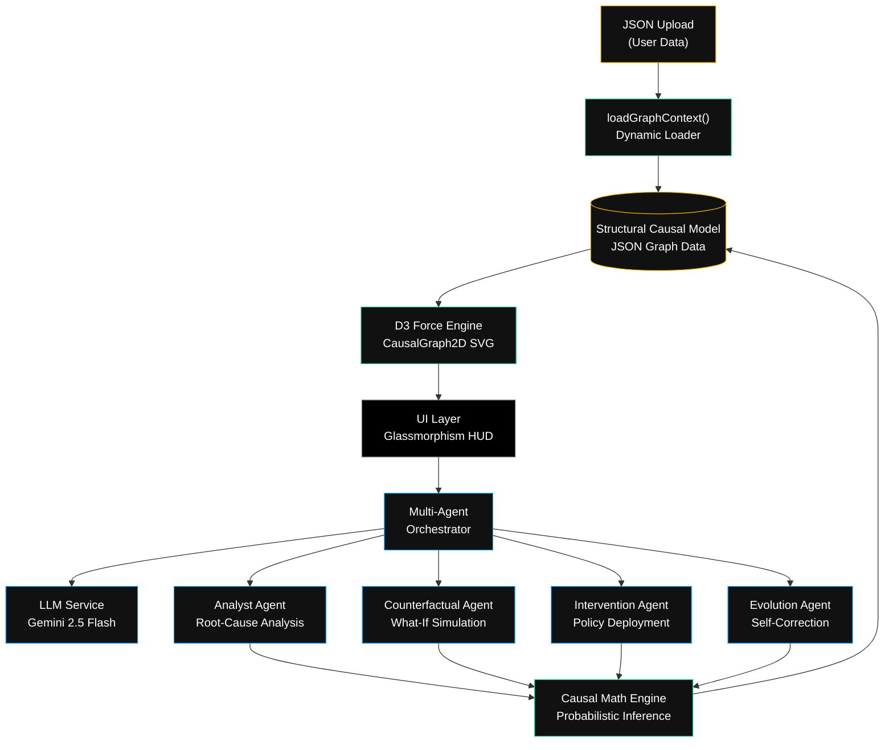

# LAPLACE
### Logical Architecture for Predictive Learning and Autonomous Causal Evolution

[](https://laplace-493514.uc.r.appspot.com)

LAPLACE is an enterprise-grade **causal intelligence** and **multi-agent reasoning** platform that runs entirely in the browser. It allows users to upload, visualize, and dynamically intervene in complex **Structural Causal Models (SCMs)** using autonomous AI agents powered by Google Gemini.

Unlike typical AI wrappers, LAPLACE provides a complete causal inference pipeline: root-cause analysis → counterfactual simulation → intervention deployment → ground-truth validation → self-evolving weight correction — all orchestrated by specialized AI agents operating on your data in real time.

---

## 🚀 Key Features

| Feature | Description |
|---|---|
| **Dynamic Data Ingestion** | Upload any SCM JSON file via the **Import** button. The platform dynamically tears down the existing graph, re-initializes all agents, and auto-generates a scenario from your data's topology. |
| **Multi-Agent Orchestration** | Four specialized agents (`AnalystAgent`, `CounterfactualAgent`, `InterventionAgent`, `EvolutionAgent`) execute "What-If" scenarios sequentially and communicate findings autonomously via the LLM. |
| **Real-time Causal Intelligence** | Models complex systemic relationships via autonomous LLM agents powered by **Google Gemini 2.5 Flash**. |
| **SVG Force Topology** | Highly-performant D3.js 2D SVG force-directed graph canvas with full pan/zoom, drag, node inspection, and edge highlighting. |
| **True Glassmorphism UI** | Premium "True Black & White" dashboard with frosted-glass translucent overlays, dot-matrix background, and Geist typography. |
| **BYOK Security** | All LLM inference uses **client-provided API keys** stored only in `localStorage`. Zero server-side key storage. |
| **Cinematic Loading** | Full-screen branded splash screen displaying the LAPLACE acronym expansion before transitioning to the dashboard. |
| **Auto Demo Mode** | One-click cinematic walkthrough that sequentially runs all five agent phases with animated transitions. |

---

## 🏗️ Architecture

LAPLACE is a complete single-page application (SPA) built with **Vite** and entirely **vanilla HTML/CSS/JS** — no React, no framework overhead.



### Component Breakdown

| Component | File | Role |
|---|---|---|
| **Entry Point** | `src/main.js` | Orchestrates boot sequence, dynamic graph loading (`loadGraphContext`), and all UI event bindings. |
| **Graph Renderer** | `src/engine/CausalGraph2D.js` | D3.js SVG force-directed layout with zoom, drag, node inspection, and edge highlighting. |
| **Agent Orchestrator** | `src/agents/AgentOrchestrator.js` | Manages the lifecycle of inference loops, dispatching tasks to specialized expert agents. |
| **Analyst Agent** | `src/agents/AnalystAgent.js` | Performs root-cause tracing through causal pathways. |
| **Counterfactual Agent** | `src/agents/CounterfactualAgent.js` | Runs "What-If" simulations with intervention overrides. |
| **Intervention Agent** | `src/agents/InterventionAgent.js` | Deploys the predicted state onto the live graph topology. |
| **Evolution Agent** | `src/agents/EvolutionAgent.js` | Compares predictions vs. ground truth and adjusts edge weights for self-improvement. |
| **Causal Math** | `src/core/CausalMath.js` | Handles probabilistic back-propagation within the SCM. |
| **Evolution Engine** | `src/core/EvolutionEngine.js` | Computes weight corrections and intelligence scores. |
| **LLM Service** | `src/core/LLMService.js` | Manages Gemini API calls with client-provided BYOK keys. |
| **HUD** | `src/ui/HUD.js` | Glassmorphism heads-up display controller wiring DOM ↔ agents. |

---

## 📊 How It Works — The 5-Phase Agent Pipeline

```
┌──────────┐    ┌──────────┐    ┌───────────┐    ┌──────────┐    ┌──────────┐
│ ANALYZE  │───▶│ WHAT-IF  │───▶│ INTERVENE │───▶│  REVEAL  │───▶│  EVOLVE  │
│          │    │          │    │           │    │          │    │          │
│ Root     │    │ Counter- │    │ Deploy    │    │ Compare  │    │ Self-    │
│ Cause    │    │ factual  │    │ predicted │    │ vs truth │    │ correct  │
│ Tracing  │    │ "What-if │    │ state     │    │ (actual  │    │ edge     │
│ via LLM  │    │  we..."  │    │ to graph  │    │  data)   │    │ weights  │
└──────────┘    └──────────┘    └───────────┘    └──────────┘    └──────────┘
```

1. **Analyze** — The Analyst Agent traces causal pathways to identify the root cause of a target metric anomaly.
2. **What-If** — The Counterfactual Agent simulates an intervention (e.g., "What if we increase test coverage from 45% to 85%?") and predicts downstream effects across the entire graph.
3. **Intervene** — The Intervention Agent deploys the predicted state onto the live topology, visually transforming node sizes and colors.
4. **Reveal** — Ground-truth data is loaded and the system computes prediction accuracy against actual outcomes.
5. **Evolve** — The Evolution Agent compares prediction errors and auto-corrects edge weights in the SCM, making the model smarter over time.

---

## 📂 Using Your Own Data

LAPLACE accepts any **Structural Causal Model** formatted as JSON. Click the **Import** button in the control bar to upload your file.

### SCM JSON Schema

```json
{
  "metadata": {
    "domain": "Your Domain Name",
    "version": "1.0.0",
    "description": "Description of your causal model"
  },
  "nodes": [
    {
      "id": "unique_node_id",
      "label": "Human Readable Name",
      "category": "input | process | quality | output | outcome | business",
      "baseline": 0.65,
      "unit": "percent | score | index | count",
      "description": "What this node represents"
    }
  ],
  "edges": [
    {
      "source": "cause_node_id",
      "target": "effect_node_id",
      "weight": 0.7,
      "type": "positive | negative",
      "description": "Why this causal relationship exists"
    }
  ],
  "temporalStates": {
    "T0": {
      "label": "Baseline State",
      "values": { "node_id": 0.65 }
    }
  },
  "categoryColors": {
    "input": "#00A3FF",
    "process": "#F2B600"
  }
}
```

### Included Example Datasets

| File | Domain | Nodes | Edges |
|---|---|---|---|
| `public/default-causal-graph.json` | Software System Health | 12 | 18 |
| `public/ecommerce-causal-graph.json` | E-Commerce Revenue | 11 | 13 |

Download the E-Commerce file from the repo, then click **Import** to load it into the live platform.

---

## 🛠️ Tech Stack

| Layer | Technology |
|---|---|
| Core Engine | Vanilla JavaScript (ES6 Modules) |
| Visualization | D3.js (Force Simulation, Zoom, SVG) |
| Build Tooling | Vite |
| Typography | Geist / GeistMono |
| Hosting | Google Cloud App Engine |
| AI Inference | Google Gemini 2.5 Flash (BYOK) |

---

## 📦 Local Installation

```bash
# 1. Clone the repository
git clone https://github.com/omshukla24/Laplace.git
cd Laplace

# 2. Install dependencies
npm install

# 3. Start development server
npm run dev
```

---

## ☁️ Deployment

LAPLACE is configured for instant deployment to Google Cloud App Engine.

```bash
# Build production bundle
npm run build

# Deploy to Google Cloud
gcloud app deploy app.yaml -q
```

---

## 📁 Project Structure

```
laplace/
├── index.html                     # Main SPA entry point + loading screen
├── app.yaml                       # Google Cloud App Engine config
├── vite.config.js                 # Vite build configuration
├── public/
│   ├── default-causal-graph.json  # Default SCM (Software Health)
│   └── ecommerce-causal-graph.json # Example SCM (E-Commerce)
├── src/
│   ├── main.js                    # Boot sequence + dynamic graph loader
│   ├── agents/
│   │   ├── AgentOrchestrator.js   # Multi-agent lifecycle manager
│   │   ├── AnalystAgent.js        # Root-cause analysis agent
│   │   ├── CounterfactualAgent.js # What-If simulation agent
│   │   ├── InterventionAgent.js   # Policy deployment agent
│   │   └── EvolutionAgent.js      # Self-correcting evolution agent
│   ├── core/
│   │   ├── CausalMath.js          # Probabilistic inference engine
│   │   ├── EvolutionEngine.js     # Weight correction + intelligence scoring
│   │   └── LLMService.js          # Gemini API client (BYOK)
│   ├── engine/
│   │   └── CausalGraph2D.js       # D3.js SVG force-directed renderer
│   ├── ui/
│   │   ├── HUD.js                 # Glassmorphism HUD controller
│   │   ├── TypewriterEffect.js    # Character-by-character text reveal
│   │   └── MetricsCounter.js      # Animated metric counters
│   ├── data/
│   │   ├── agent-scripts.json     # Pre-computed agent dialogue scripts
│   │   └── scenarios.json         # Default scenario configurations
│   └── styles/
│       └── index.css              # Complete design system
└── dist/                          # Production build output
```

---

## 🔒 Security Model

LAPLACE uses a **Bring-Your-Own-Key (BYOK)** architecture:

- API keys are entered by the user and stored **only in the browser's `localStorage`**.
- Keys are sent directly from the client to the Google Gemini API — they **never touch any server**.
- There is no backend, no database, and no server-side processing of user credentials.
- Users can clear their key at any time by clearing browser storage.

---

## 📄 License

Built for the **Google Tech Builders Program Hackathon 2025**.
