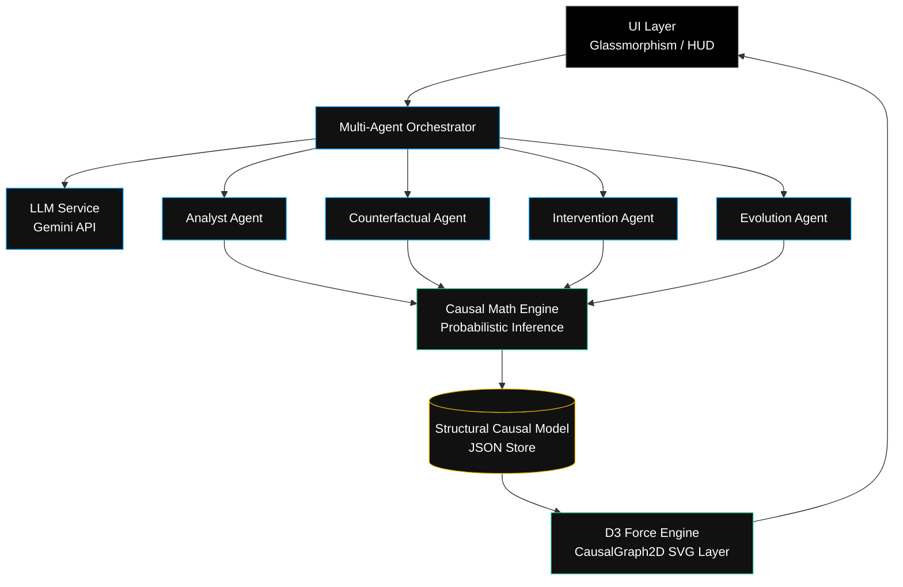

# LAPLACE
### Logical Architecture for Predictive Learning and Autonomous Causal Evolution

LAPLACE is an enterprise-grade causal intelligence and multi-agent simulation platform. Originally designed as an experimental 3D conceptual space, it has evolved into a performant, production-ready 2D dashboard powered by an SVG-based force-directed graph engine. Operating entirely in the browser, LAPLACE allows users to visualize, simulate, and dynamically intervene in complex Structural Causal Models (SCMs) using autonomous AI agents.

## 🚀 Key Features

* **Real-time Causal Intelligence**: Models complex systemic relationships via autonomous LLM agents (powered by Google Gemini 2.5 Flash).
* **Multi-Agent Orchestration**: Specialized agents (`AnalystAgent`, `CounterfactualAgent`, `InterventionAgent`, `EvolutionAgent`) execute "What-If" scenarios sequentially and communicate findings autonomously.
* **SVG Force Topology**: Deprecated the resource-heavy Three.js 3D layer for a highly-performant, crisp D3.js 2D SVG canvas optimized for causal observability.
* **True Glassmorphism UI**: High-fidelity, data-driven "True Black & White" dashboard with beautiful frosted-glass translucent overlays mapped over a dot-matrix metric background. 
* **Bring-Your-Own-Key (BYOK) Security**: Fully decoupled secure infrastructure where all LLM inference operations occur utilizing client-provided API keys scoped to local storage. 
* **Cinematic Experience**: Loading splash screens and fully autonomous node-reveals to give users a breathtaking software experience.

## 🏗️ Architecture

LAPLACE is a complete single-page application (SPA) built using Vite and entirely vanilla HTML/CSS/JS.



### Component Breakdown
1. **Multi-Agent Orchestrator (`AgentOrchestrator.js`)**: Manages the life cycle of inference loops, dispatching tasks to specific expert agents.
2. **Causal Topology Renderer (`CausalGraph2D.js`)**: Renders states, highlights active hypotheses, and visualizes nodes on an interactive SVG canvas.
3. **Causal Mathematics (`CausalMath.js`)**: Handles back-propagation of probabilities within the structural causal model graph. 

## 🛠️ Tech Stack
- Core Engine: **Vanilla JavaScript (ES6 Modules)**
- Visualization Engine: **D3.js** (Zoom, Force Simulation)
- Build Tooling: **Vite**
- Hosting: **Google Cloud App Engine**
- AI Inference: **Google Gemini API** (Configured securely via local BYOK)

## 📦 Local Installation

To run LAPLACE on your local machine:

1. Clone this repository.
2. Install npm dependencies:
```bash
npm install
```
3. Run the development environment:
```bash
npm run dev
```

## ☁️ Deployment

LAPLACE is configured for instant deployment to Google Cloud App Engine serving a static bundled site.

1. Build for production:
```bash
npm run build
```
2. Deploy to Google Cloud:
```bash
gcloud app deploy app.yaml -q
```
